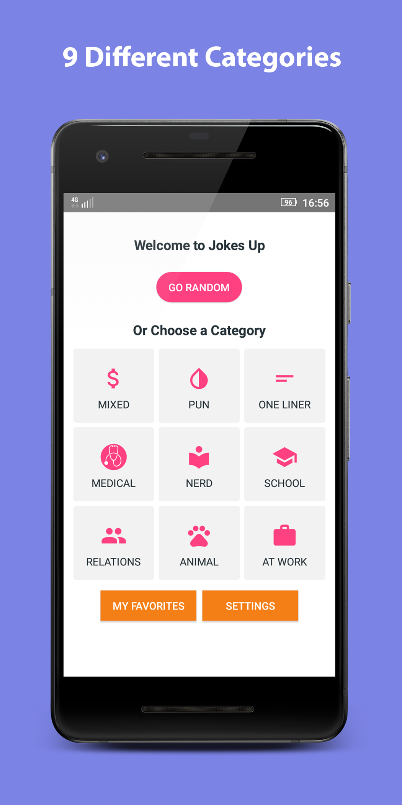
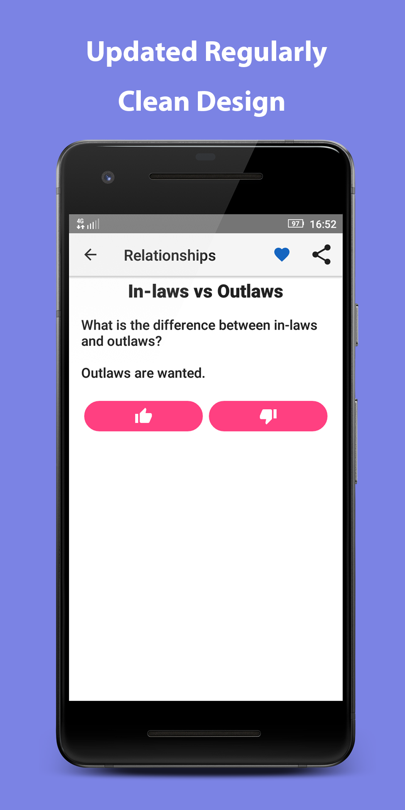
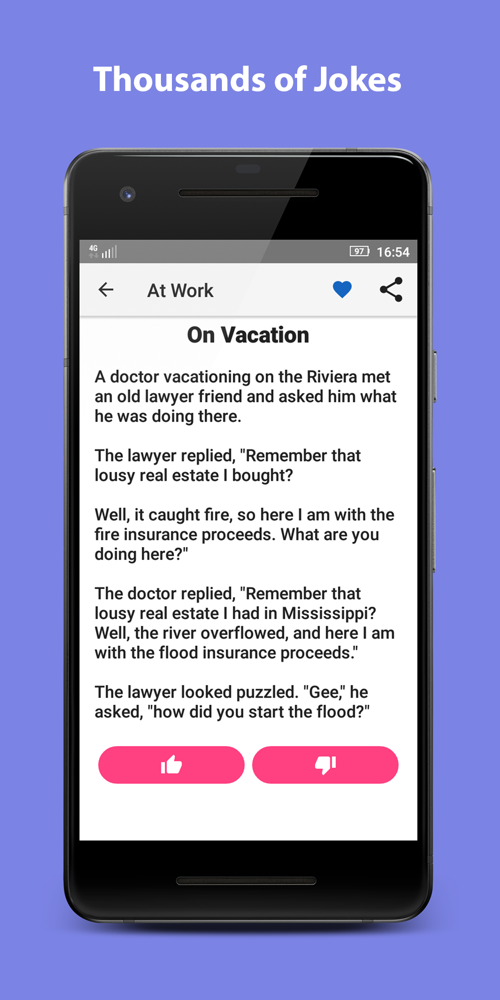
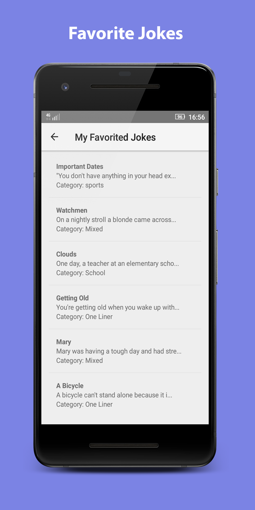

# Jokes Up
An Android app for jokes

## Features

- Clean and simple design

- Works offline

- Firebase integration for getting new joke patches and uploading user joke ratings

- GDPR compliant

## Screenshots

## Where is this app available?
You can get it on [Google Play](https://play.google.com/store/apps/details?id=com.vinyentertainment.jokesup)

## License
Jokes Up is licensed under GNU General Public License v3.0
